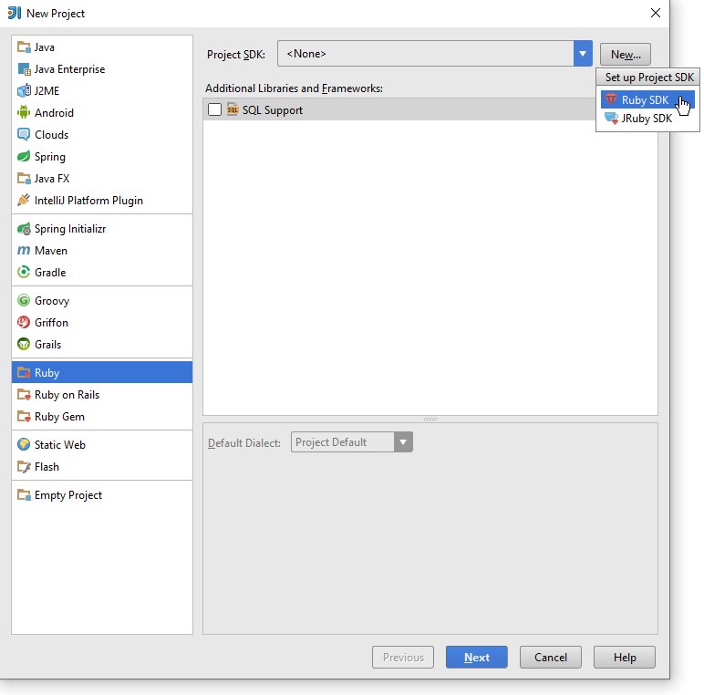

= Ruby example with MD5 checker over file system
:revdate: {docdate}
:toc: left
:sectanchors:
:Author: Tibor Digaňa
:numbered:
:star: *

image::https://github.com/Tibor17/maven-ruby-docker-example/workflows/CI/badge.svg?branch=master[link="https://github.com/Tibor17/maven-ruby-docker-example/actions/"]

== Install Ruby SDK 2.6.5

=== Install native Ruby SDK on your system

https://rubyinstaller.org/downloads/[Download] the native SDK and install it on your system.

=== Install Ruby SDK in IntelliJ IDEA

Follow the https://www.jetbrains.com/help/idea/creating-and-running-your-first-language-project.html#[reference guide]
and install the https://www.jetbrains.com/help/idea/ruby-plugin.html#install_ruby_plugin[Ruby plugin for IDEA].

== CLI Ruby application

The asset files are located in `src/test/ruby/assets` for testing purposes.
The file `a.txt` is single and the `b.txt` appears twice with different content.

Run the commandline application as follows

[source,shell,subs="verbatim,attributes"]
----
$ ruby src/main/ruby/checksums/PrintDeepFilestructuresMD5.rb *\.txt

Found (2) files with the same MD5: 60b725f10c9c85c70d97880dfe8191b3:
C:/vcs/github/tibor17/maven-ruby-docker-example/src/test/ruby/assets/a.txt
C:/vcs/github/tibor17/maven-ruby-docker-example/src/test/ruby/assets/subdir/a.txt

a.txt
    MD5: 60b725f10c9c85c70d97880dfe8191b3
    MD5: 60b725f10c9c85c70d97880dfe8191b3

b.txt
    MD5: ba1f2511fc30423bdbb183fe33f3dd0f
    MD5: c0710d6b4f15dfa88f600b0e6b624077
----

You can specify the directory with custom asset directory and the file name pattern as follows:

`$ ruby src/main/ruby/checksums/PrintDeepFilestructuresMD5.rb /path/to/asset/dir *\.txt`

== Build the Docker image and run the container with CLI application

[source,shell,subs="verbatim,attributes"]
----
$ docker build -t tibor17/ruby-md5 .

Sending build context to Docker daemon  180.7kB
Step 1/7 : FROM ruby:2-slim
 ---> 60bc28d65d84
Step 2/7 : ARG USER_HOME_DIR="/root"
 ---> Using cache
 ---> 42ed6006c318
Step 3/7 : LABEL maintainer="Tibor Digaňa"
 ---> Using cache
 ---> 1c62656c7e5d
Step 4/7 : WORKDIR ${USER_HOME_DIR:-/root}
 ---> Using cache
 ---> ab783801025d
Step 5/7 : ADD . .
 ---> c5f2f84ee903
Step 6/7 : ENTRYPOINT ["/bin/sh", "-c"]
 ---> Running in a1a1bed1caad
Removing intermediate container a1a1bed1caad
 ---> 6cde3fac3530
Step 7/7 : CMD ["ruby -v /root/src/main/ruby/checksums/PrintDeepFilestructuresMD5.rb /root/src/test/ruby/assets *\\.txt"]
 ---> Running in dde4ca524ec1
Removing intermediate container dde4ca524ec1
 ---> a453b510ba9c
Successfully built a453b510ba9c
Successfully tagged tibor17/ruby-md5:latest
----

[source,shell,subs="verbatim,attributes"]
----
$ docker run -it --rm tibor17/ruby-md5:latest
ruby 2.6.5p114 (2019-10-01 revision 67812) [x86_64-linux]

Found (2) files with the same MD5: 60b725f10c9c85c70d97880dfe8191b3:
/root/src/test/ruby/assets/a.txt
/root/src/test/ruby/assets/subdir/a.txt

a.txt
    MD5: 60b725f10c9c85c70d97880dfe8191b3
    MD5: 60b725f10c9c85c70d97880dfe8191b3

b.txt
    MD5: ba1f2511fc30423bdbb183fe33f3dd0f
    MD5: c0710d6b4f15dfa88f600b0e6b624077
----

== Build the Maven project and execute the tests

See the GitHub CI or simply run `mvn test`.

See the integration tests in https://github.com/torquebox/jruby-maven-plugins for more information.

[subs="verbatim,attributes"]
----
[INFO] --- maven-surefire-plugin:3.0.0-M4:test (default-test) @ maven-ruby-docker-example ---
[INFO]
[INFO] -------------------------------------------------------
[INFO]  T E S T S
[INFO] -------------------------------------------------------
[INFO] Running checksums.PrintDeepFilestructuresMD5Test
[INFO] Tests run: 1, Failures: 0, Errors: 0, Skipped: 0, Time elapsed: 3.211 s - in checksums.PrintDeepFilestructuresMD5Test
[INFO]
[INFO] Results:
[INFO]
[INFO] Tests run: 1, Failures: 0, Errors: 0, Skipped: 0
----
